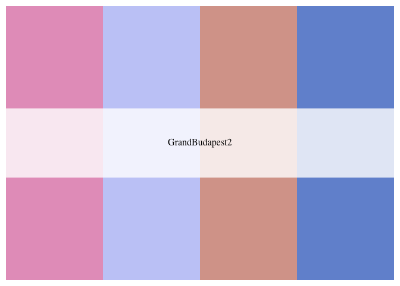

Homework 3
================
Ronae McLin rkm2147

``` r
library(wesanderson)
wes_palette("GrandBudapest2")
```

<!-- -->

``` r
library(tidyverse)
```

    ## ── Attaching packages ─────────────────────────────────────── tidyverse 1.3.0 ──

    ## ✓ ggplot2 3.3.2     ✓ purrr   0.3.4
    ## ✓ tibble  3.0.1     ✓ dplyr   1.0.0
    ## ✓ tidyr   1.1.0     ✓ stringr 1.4.0
    ## ✓ readr   1.3.1     ✓ forcats 0.5.0

    ## ── Conflicts ────────────────────────────────────────── tidyverse_conflicts() ──
    ## x dplyr::filter() masks stats::filter()
    ## x dplyr::lag()    masks stats::lag()

``` r
library(patchwork)
library(ggridges)
library(wesanderson)


knitr::opts_chunk$set(
  fig.width = 6,
  fig.asp = .6,
  out.width = "90%"
)
theme_set(theme_minimal() + theme(legend.position = "bottom"))

options(
  ggplot2.continuous.colour = "GrandBudapest2",
  ggplot2.continuous.fill = "GrandBudapest2"
)

scale_colour_discrete = scale_color_viridis_d

scale_fill_discrete = scale_fill_viridis_d
```

don’t forget to load this

``` r
library(rvest)
```

    ## Loading required package: xml2

    ## 
    ## Attaching package: 'rvest'

    ## The following object is masked from 'package:purrr':
    ## 
    ##     pluck

    ## The following object is masked from 'package:readr':
    ## 
    ##     guess_encoding

``` r
library(httr)
```

## scrape a table

i want the first table

``` r
url = "http://samhda.s3-us-gov-west-1.amazonaws.com/s3fs-public/field-uploads/2k15StateFiles/NSDUHsaeShortTermCHG2015.htm"
```

``` r
drug_use_html = read_html(url)
```

extract tables

``` r
tabl_marj = 
drug_use_html %>% 
  html_nodes(css = "table") %>% 
  first() %>% 
  html_table() %>%  
  slice(-1) %>% 
  as_tibble()
```
